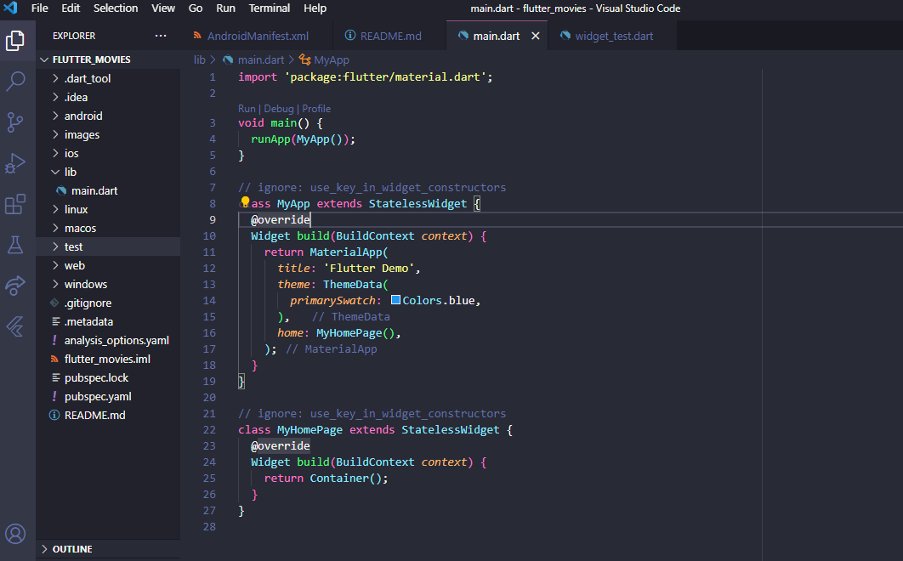
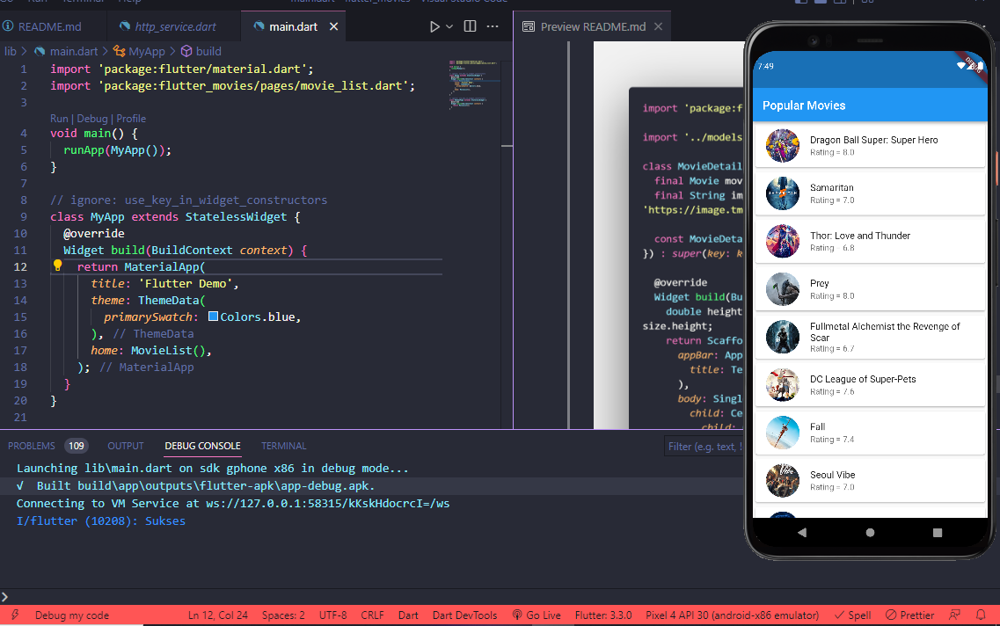

# 7.3.2 Mengkoneksikan Aplikasi Flutter ke themoviedb dengan package http
1. Untuk mengakses internet kita harus menambahkan permission internet pada android
manifest cari lah file android manifest.xml pada folder
android/app/scr/main/AndroidManifest.xml kemudian tambahkan permission internet.

2. Hapus komentar yang ada pada file main.dart dari kode program awal.
3. Ubah MyHomePage menjadi stateless widget.

4. Buat file baru baru “pages” pada folder lib dan buat sebuah file dengan nama
movie_list.dart.

5. Buat sebuah statefull widget pada file movie_list.dart

6. Import File movie_list.dart ke main.dart dan gunakan movie_list.dart sebagai return
dari class MyHomePage

7. Sebelum melanjutkan ke pembuatan aplikasi kita buat terlebih dahulu sebuah helper
class untuk konek ke rest api themoviedb. Buat lah sebuah folder dengan nama
service dan isi dengan file http_service.dart.

8. Selanjutnya buat sebuah function untuk mengambil response dari server
themoviedb.org
10. Pada function _MovieListState tambahkan variabel berikut ini untuk variabel service
jangan lupa import dulu file httpservice nya.

11. Kemudian tambahkan method override init state agar permintaan ke rest api dapat
dilakukan ketika state di inisialisasi.

12. Selanjutnya update function build pada movieListState dengan menggunakan widget
scaffold.

13. Jalankan aplikasi, jika di awal terjadi error reload menggunakan hot restart.

# 7.3.3 Membuat model untuk response http
1. Buat folder models didalam folder lib dan isikan dengan file movie.dart

2. Di dalam movie.dart buat lah sebuah class movie lengkap dengan variabel dan
construktor seperti dibawah ini.

3. Selanjutnya buatlah sebuah function untuk mengkonversi json menjadi response yang
sesuai dengan class movie.

4. Selanjutnya update function http_service.dart menjadi seperti dibawah ini.

# 7.4 Membuat halaman list Populer Movie
Untuk membuat list view pada widget movie list anda memerlukan beberapa widget baru
antara lain list view dan card. Selain itu juga dibutuhkan data dari http service. Langkah
langkah yang perlu dilakukan adalah sebagai berikut :
1. Update inisialisasi variabel pada class movieliststate

2. Tambahkan method initialize() pada class movieliststate

3. Tambahkan function initialize pada initState

4. Selanjutnya buat listview dan card berdasarkan data dari initialize

5. Lakukan hot restart dan aplikasi akan berubah menjadi seperti dibawah ini.

6. Selamat anda berhasil membuat listview sekarang saatnya mempercantik listview
yang dibuat.
7. Challenge : carilah cara menambahkan gambar dari response api ke listview,
tambahkan gambar tersebut ke listview.

# 7.5 Membuat halaman detail Populer Movie
1. Untuk membuat perpindahan dari movie list ke movie detail buatlah onTap event di
listview pada movie list.

2. Pada event on tap Widget MovieDetail belum dibuat, buatlah widget ini pada folder
pages/movie_detail.dart.

3. Lengkapi Movie Detail untuk menerima parameter Movies

4. Lengkapi detail widget.

result

detail
